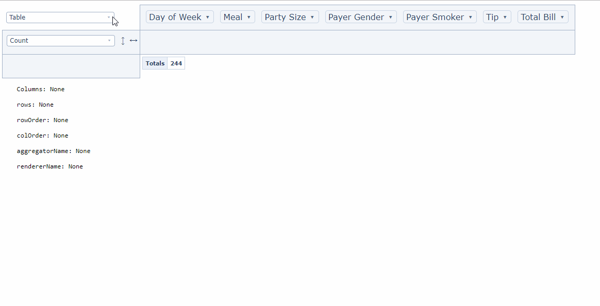
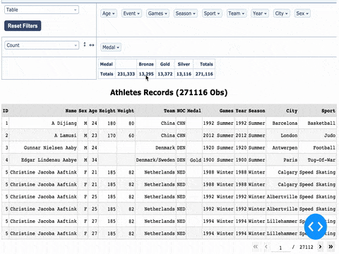

# Dash Pivottable

Dash Pivottable is a Dash component wrapping the [react-pivottable library](https://github.com/plotly/react-pivottable/), created by Nicholas at Plotly. It lets you build interactive pivot tables using purely Python.



We have created a Custom Dash Pivottable component that filters a linked-by-callback data table using cell-clicks on the Dash Pivottable. We utilized the Dash boilerplate to add a clickCallback that fetches matching records of a cell-click into an attribute called selectData of the Dash Pivottable component. This attribute can be used in a user’s program callbacks with the Dash DataTable that is populated with the records from the clicked cell. Since the clickCallback to update the data table is executed on the client side, the runtime is seamlessly efficient. We think that this functionality will have many use cases, and we wonder if this can be integrated to the current Dash Pivottable in the future.

Below is an example of the custom component linked to a Dash DataTable in action. Notice that the pivot table is used as a filter, and the data table’s title reflects number of observations resulting from each cell-click filter:



(Data source: [120 years of Olympic history: athletes and results](https://www.kaggle.com/heesoo37/120-years-of-olympic-history-athletes-and-results))

We like to start a conversation with the community to know how to best contribute the custom Dash Pivottable coupled with a client side callback to a Dash DataTable. An alternative is to extend the Dash Pivottable component with a built-in data table. We look forward to a conversation on these approaches. We will also be offering to the community enhancements to the Dash Pivottable and its underlying react-pivottable that comprise the Custom Dash Pivottable. We also have fix to Issue #109, ClickCallback with more than one column attribute does not function right for react-pivottable. This will be in a separate posting.

## Getting Started

Make sure to clone this project, create a venv and install requirements:
```commandline
$ git clone https://github.com/xhlulu/dash_pivottable.git
$ cd dash_pivottable
$ virtualenv venv
$ source venv/bin/activate
$ pip install -r requirements.txt
```

And simply run the example in the venv:
```commandline
python usage.py
```

## References

The following parameters can be modified:
- id (string; optional): The ID used to identify this component in Dash callbacks
- data (list; optional): The input data
- hiddenAttributes (list; optional): contains attribute names to omit from the UI
- hiddenFromAggregators (list; optional): contains attribute names to omit from the aggregator arguments dropdowns
- hiddenFromDragDrop (list; optional): contains attribute names to omit from the drag'n'drop portion of the UI
- menuLimit (number; optional): maximum number of values to list in the double-click menu
- unusedOrientationCutoff (number; optional): If the attributes' names' combined length in characters exceeds this
value then the unused attributes area will be shown vertically to the
left of the UI instead of horizontally above it. 0 therefore means
'always vertical', and Infinity means 'always horizontal'.

The following props can be used as an input to callbacks, but can't be modified:
- cols (list; optional): Which columns are currently in the column area
- colOrder (string; optional): The order in which column data is provided to the renderer, must be one
of "key_a_to_z", "value_a_to_z", "value_z_to_a", ordering by value
orders by column total
- rows (list; optional): Which rows is currently inside the row area.
- rowOrder (string; optional): The order in which row data is provided to the renderer, must be one
of "key_a_to_z", "value_a_to_z", "value_z_to_a", ordering by value
orders by row total
- aggregatorName (string; optional): Which aggregator is currently selected. E.g. Count, Sum, Average, etc.
- vals (list; optional): Attribute names used as arguments to aggregator (gets passed to aggregator generating function)
- rendererName (string; optional): Which renderer is currently selected. E.g. Table, Line Chart, Scatter
- valueFilter (dictionnary; optional): Object whose keys are attribute names and values are objects of attribute value-boolean pairs which denote records to include or exclude from computation and rendering; used to prepopulate the filter menus that appear on double-click

Default Values:
* menuLimit: 500
* unusedOrientationCutoff: 85
* hiddenAttributes: []
* hiddenFromAggregators: []
* hiddenFromDragDrop: []
    
## Notice

This is currently a community-maintained library, and is not an official Plotly product. If you would like to develop this, please reach out to me. If you would like to see official support, please reach out to [Plotly directly](https://plot.ly/products/consulting-and-oem/).
